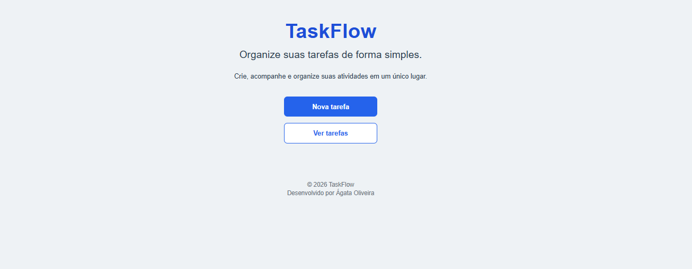
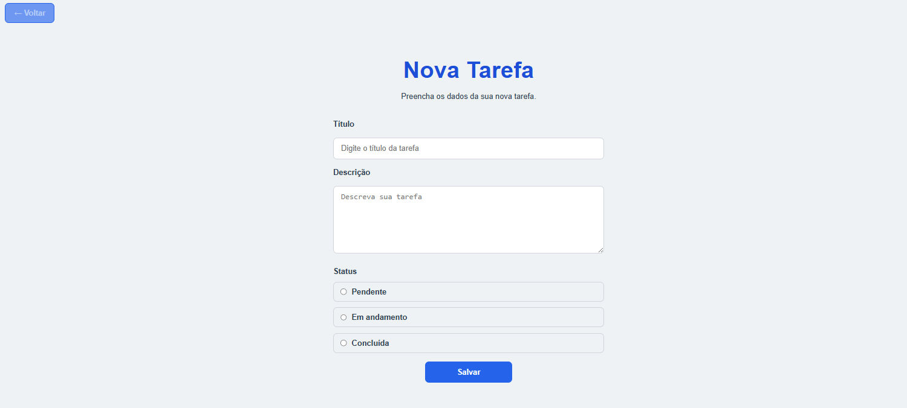
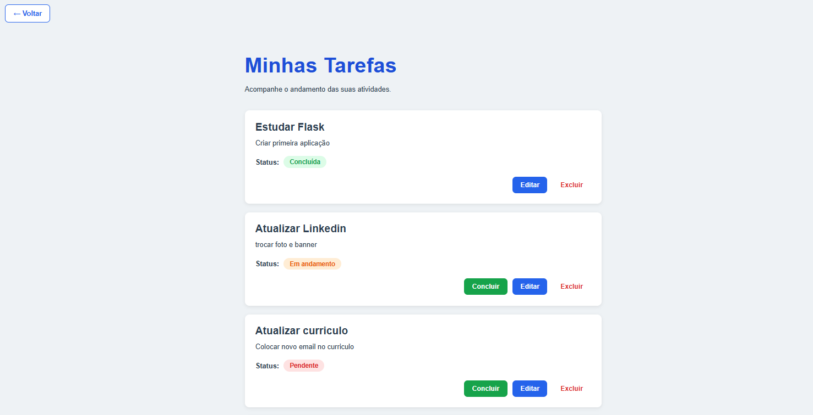
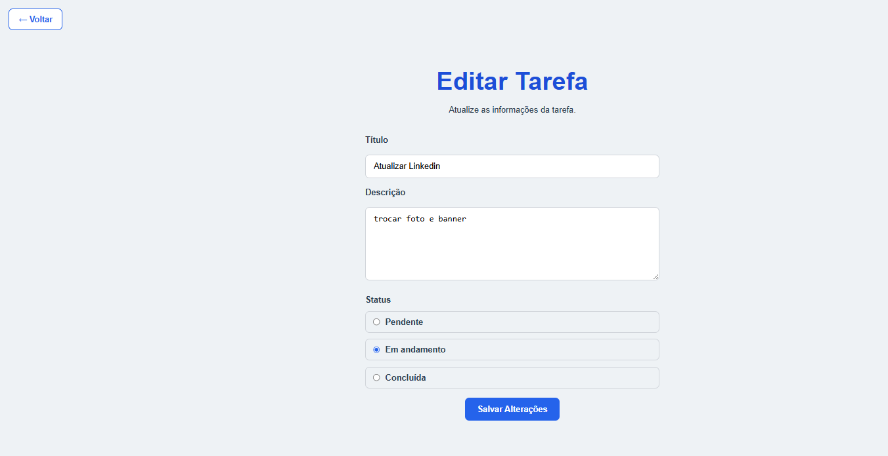

# 📋 TaskFlow

<p align="center">

Sistema web para gerenciamento de tarefas desenvolvido com **Flask** e **SQLite**, criado como projeto da disciplina de **Engenharia de Software** para aplicar conceitos de desenvolvimento web, versionamento com Git, metodologias ágeis, testes automatizados e integração contínua.

</p>

<p align="center">

🎥 **Assista à demonstração do projeto:**
<br>
<a href="https://www.linkedin.com/posts/%C3%A1gata-santos-dev_python-flask-sqlite-ugcPost-7480590467341086720-1c41/?utm_source=share&utm_medium=member_desktop&rcm=ACoAAFmE7EABUKiP6kx_EaoHd56PscMBNW3hYIY">
📺 Vídeo de apresentação do TaskFlow
</a>

</p>

<p align="center">


</p>

## 📑 Índice

- 📖 Sobre o Projeto
- 📸 Demonstração
- 🎯 Objetivos
- ✨ Funcionalidades
- 🛠️ Tecnologias
- 🏗️ Arquitetura
- 📂 Estrutura de Pastas
- ⚙️ Como Executar
- 🧪 Testes
- 🔄 Integração Contínua
- 📋 Gerenciamento do Projeto
- 📈 Mudança de Escopo
- 🚀 Melhorias Futuras
- 👩‍💻 Autora

---

# 📖 Sobre o Projeto

O **TaskFlow** é uma aplicação web para gerenciamento de tarefas desenvolvida com **Flask**, **SQLite**, **HTML5** e **CSS3**. O projeto foi criado como atividade prática da disciplina de **Engenharia de Software**, proporcionando a aplicação de conceitos de desenvolvimento de software, organização de projetos e boas práticas de programação.

A aplicação permite cadastrar, visualizar, editar, concluir e excluir tarefas por meio de uma interface simples e intuitiva, com persistência de dados em banco de dados SQLite.

Durante o desenvolvimento foram aplicados conceitos como:

- Desenvolvimento de aplicações web com Flask;
- Persistência de dados utilizando SQLite;
- Organização modular do código;
- Versionamento com Git e GitHub;
- Planejamento utilizando metodologia Kanban;
- Testes automatizados com Pytest;
- Integração contínua com GitHub Actions;
- Documentação técnica do projeto.

Além de atender aos requisitos da disciplina, o projeto também serviu como oportunidade para praticar a evolução incremental do software, passando por diversas melhorias de interface, organização do código e experiência do usuário ao longo das sprints de desenvolvimento.

---

## 📸 Demonstração

A seguir são apresentadas as principais telas do **TaskFlow**, demonstrando as funcionalidades implementadas na primeira versão da aplicação.

### 🏠 Página Inicial



---

### ➕ Cadastro de Tarefa



---

### 📋 Lista de Tarefas



---

### ✏️ Edição de Tarefa



---

# 🎯 Objetivos

## Objetivo Geral

Desenvolver uma aplicação web para gerenciamento de tarefas, aplicando conceitos de Engenharia de Software por meio da utilização de desenvolvimento web com Flask, persistência de dados, versionamento de código, metodologias ágeis, testes automatizados e integração contínua.

## Objetivos Específicos

- Desenvolver uma aplicação CRUD para gerenciamento de tarefas.
- Implementar persistência de dados utilizando SQLite.
- Aplicar boas práticas de organização e estruturação de código.
- Utilizar Git e GitHub para controle de versão.
- Gerenciar o desenvolvimento utilizando GitHub Projects e metodologia Kanban.
- Implementar testes automatizados com Pytest.
- Configurar integração contínua utilizando GitHub Actions.
- Produzir documentação técnica completa do projeto.

---

# ✨ Funcionalidades

O **TaskFlow** oferece as principais funcionalidades necessárias para o gerenciamento de tarefas, proporcionando uma experiência simples, intuitiva e organizada.

## Funcionalidades implementadas

- ➕ **Cadastrar tarefas**, informando título, descrição e status inicial.
- 📋 **Listar todas as tarefas** cadastradas em uma interface organizada.
- ✏️ **Editar tarefas** para atualizar título, descrição e status.
- ✅ **Concluir tarefas** com um único clique, sem necessidade de acessar a tela de edição.
- 🗑️ **Excluir tarefas** do sistema.
- 🎨 **Identificação visual do status** por meio de cores para facilitar o acompanhamento das atividades.
- 💾 **Persistência de dados** utilizando banco de dados SQLite.
- 🔔 **Mensagens de confirmação (Flash Messages)** para informar o sucesso das operações realizadas.
- 🖥️ **Interface intuitiva e organizada**, desenvolvida para proporcionar uma navegação simples e agradável.

## Operações disponíveis

O sistema contempla as quatro operações fundamentais de um CRUD:

- **Create** — Cadastro de novas tarefas.
- **Read** — Visualização das tarefas cadastradas.
- **Update** — Atualização das informações das tarefas.
- **Delete** — Remoção de tarefas.

---

# 🛠️ Tecnologias

As seguintes tecnologias e ferramentas foram utilizadas no desenvolvimento do **TaskFlow**:

| Tecnologia | Finalidade |
|------------|------------|
| Python 3.12 | Linguagem principal da aplicação |
| Flask | Framework para desenvolvimento da aplicação web |
| SQLite | Banco de dados para persistência das tarefas |
| HTML5 | Estrutura das páginas |
| CSS3 | Estilização da interface |
| Git | Controle de versão |
| GitHub | Hospedagem do repositório |
| GitHub Projects | Organização das atividades utilizando Kanban |
| GitHub Actions | Integração contínua e execução automatizada dos testes |
| Pytest | Testes automatizados |
| Visual Studio Code | Ambiente de desenvolvimento |

---

# 🏗️ Arquitetura do Projeto

O **TaskFlow** foi desenvolvido seguindo uma organização modular, separando a lógica da aplicação, a camada de persistência de dados, os arquivos de interface e os recursos estáticos. Essa estrutura facilita a manutenção, a escalabilidade e a compreensão do código.

## Organização da aplicação

- **app.py**: contém as rotas da aplicação, o controle do fluxo das requisições e a integração entre a interface e o banco de dados.
- **database.py**: responsável pelas operações de acesso ao banco de dados SQLite, como criação, consulta, inserção, atualização e exclusão de tarefas.
- **templates/**: reúne todas as páginas HTML renderizadas pelo Flask.
- **static/**: armazena os arquivos estáticos, como folhas de estilo (CSS) e imagens utilizadas pela aplicação.
- **tests/**: contém os testes automatizados desenvolvidos com Pytest.
- **.github/workflows/**: reúne os arquivos responsáveis pela execução da integração contínua utilizando GitHub Actions.

Essa organização segue o princípio da separação de responsabilidades, tornando o projeto mais organizado e facilitando futuras evoluções da aplicação.

---

# 📂 Estrutura de Pastas

```text
TaskFlow/
│
├── .github/
│   └── workflows/
│
├── docs/
│   ├── diagrams/
│   ├── images/
│   ├── reports/
│   ├── product-backlog.md
│   └── project-planning.md
│
├── src/
│   ├── static/
│   │   ├── css/
│   │   │   └── style.css
│   │   └── images/
│   │
│   ├── templates/
│   │   ├── index.html
│   │   ├── nova_tarefa.html
│   │   ├── editar_tarefa.html
│   │   └── tarefas.html
│   │
│   ├── app.py
│   ├── database.py
│   └── __init__.py
│
├── tests/
│
├── .gitignore
├── LICENSE
├── README.md
├── requirements.txt
└── taskflow.db
```

### Descrição dos diretórios

| Diretório | Descrição |
|-----------|-----------|
| `.github/workflows` | Configuração da integração contínua utilizando GitHub Actions. |
| `docs` | Documentação do projeto, planejamento, backlog e materiais de apoio. |
| `src` | Código-fonte da aplicação. |
| `src/templates` | Páginas HTML renderizadas pelo Flask. |
| `src/static` | Arquivos estáticos da aplicação, como CSS e imagens. |
| `tests` | Testes automatizados desenvolvidos com Pytest. |

---

# ⚙️ Como Executar

Siga os passos abaixo para executar o projeto em sua máquina.

## 1. Clone o repositório

```bash
git clone https://github.com/agatasantos622/TASKFLOW.git
```

## 2. Acesse a pasta do projeto

```bash
cd TaskFlow
```

## 3. (Opcional) Crie um ambiente virtual

### Windows

```bash
python -m venv .venv
.venv\Scripts\activate
```

### Linux/macOS

```bash
python3 -m venv .venv
source .venv/bin/activate
```

## 4. Instale as dependências

```bash
pip install -r requirements.txt
```

## 5. Execute a aplicação

```bash
python src/app.py
```

## 6. Acesse no navegador

```
http://127.0.0.1:5000
```

Ao iniciar a aplicação pela primeira vez, o banco de dados SQLite será criado automaticamente, caso ainda não exista.

---

# 🧪 Testes

O projeto conta com testes automatizados desenvolvidos utilizando o **Pytest**, garantindo que as principais funcionalidades da aplicação sejam validadas de forma automática.

## Como executar os testes

```bash
pytest
```

Os testes contribuem para aumentar a confiabilidade da aplicação, permitindo identificar rapidamente possíveis regressões após alterações no código.

---

## 🔄 Integração Contínua

O projeto utiliza **GitHub Actions** para automatizar a execução dos testes sempre que alterações são enviadas para a branch principal (`main`) ou quando um Pull Request é aberto.

O workflow realiza automaticamente as seguintes etapas:

- Configuração do ambiente Python 3.12;
- Instalação das dependências do projeto;
- Execução dos testes automatizados utilizando Pytest.

Essa estratégia permite identificar falhas rapidamente, garantindo maior confiabilidade e qualidade durante o desenvolvimento.

O arquivo de configuração da Integração Contínua encontra-se em:

.github/workflows/python-tests.yml

---

## 📋 Gerenciamento do Projeto

O desenvolvimento do **TaskFlow** foi organizado utilizando a metodologia **Kanban** por meio do **GitHub Projects**.

As atividades foram distribuídas em sprints, permitindo acompanhar a evolução do projeto desde o planejamento inicial até a entrega da primeira versão (**MVP**).

Durante o desenvolvimento foram utilizadas as seguintes etapas:

- 📌 Backlog
- 🚧 Em Desenvolvimento
- 👀 Em Revisão
- ✅ Concluído

Essa organização contribuiu para um desenvolvimento incremental, facilitando o acompanhamento das funcionalidades implementadas, das correções realizadas e das melhorias planejadas.


---

# 📈 Mudança de Escopo

Durante o desenvolvimento do **TaskFlow**, o escopo inicial foi revisado para incorporar melhorias identificadas ao longo das sprints.

Inicialmente, o projeto tinha como objetivo implementar as operações básicas de um sistema CRUD para gerenciamento de tarefas. Entretanto, conforme o desenvolvimento avançou, novas funcionalidades e refinamentos foram adicionados para melhorar a experiência do usuário e a organização da aplicação.

Entre as principais evoluções implementadas destacam-se:

- Persistência de dados utilizando SQLite;
- Marcação rápida de tarefas como concluídas;
- Identificação visual dos status por meio de cores;
- Mensagens de confirmação (*Flash Messages*);
- Refinamento da interface com melhorias de usabilidade;
- Reorganização do código visando facilitar a manutenção.

Essas alterações demonstram a adaptação do projeto às necessidades identificadas durante o desenvolvimento, seguindo um processo incremental alinhado às práticas da Engenharia de Software.

---

# 🚀 Melhorias Futuras

Embora o **TaskFlow** tenha atingido os objetivos propostos para sua primeira versão (**MVP**), diversas funcionalidades e melhorias já foram planejadas para versões futuras.

## 🎯 Funcionalidades

- Implementar visualização das tarefas em formato **Kanban**;
- Adicionar sistema de pesquisa por título;
- Criar filtros por status das tarefas;
- Permitir ordenação automática por prioridade e status;
- Implementar níveis de prioridade (Baixa, Média e Alta);
- Adicionar dashboard com indicadores e estatísticas.

## 🎨 Interface

- Aprimorar a experiência do usuário (UX);
- Criar um modo escuro (Dark Mode);
- Melhorar a responsividade para dispositivos móveis;
- Adicionar animações e transições mais suaves;
- Refinar o layout da página de tarefas.

## ⚙️ Estrutura do Projeto

- Criar um arquivo `run.py` na raiz do projeto para simplificar a execução da aplicação;
- Revisar a estrutura de diretórios visando maior escalabilidade;
- Remover arquivos gerados automaticamente do versionamento, como `__pycache__` e o banco de dados SQLite.

## ☁️ Implantação

- Realizar o deploy da aplicação;
- Containerizar o projeto utilizando Docker;
- Configurar um banco de dados para ambiente de produção.

As melhorias listadas representam possibilidades de evolução do projeto e demonstram a preocupação com sua manutenção, escalabilidade e aprimoramento contínuo.

---

# 👩‍💻 Autora

Desenvolvido por **Ágata Oliveira** como projeto da disciplina de **Engenharia de Software**.

Este projeto foi desenvolvido com o objetivo de consolidar conhecimentos em desenvolvimento web utilizando Flask, persistência de dados com SQLite, versionamento com Git e GitHub, metodologias ágeis, testes automatizados e integração contínua.

Além de atender aos requisitos acadêmicos, o **TaskFlow** representa a consolidação dos conhecimentos adquiridos ao longo da disciplina, reunindo conceitos técnicos, organização de projeto e boas práticas de desenvolvimento de software.

---

⭐ Se este projeto foi útil ou interessante para você, considere deixar uma estrela no repositório!